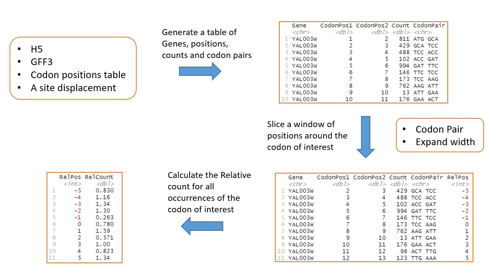
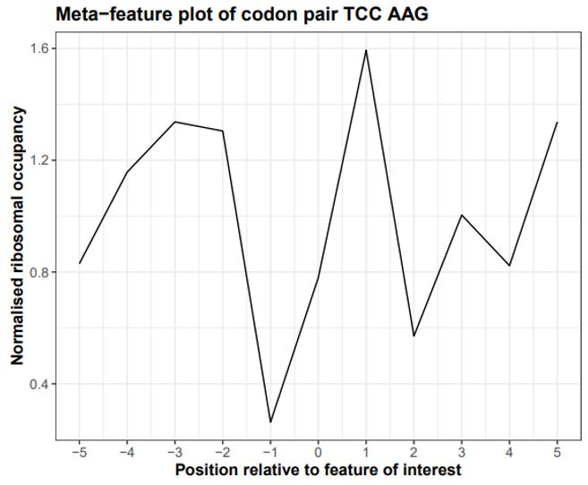
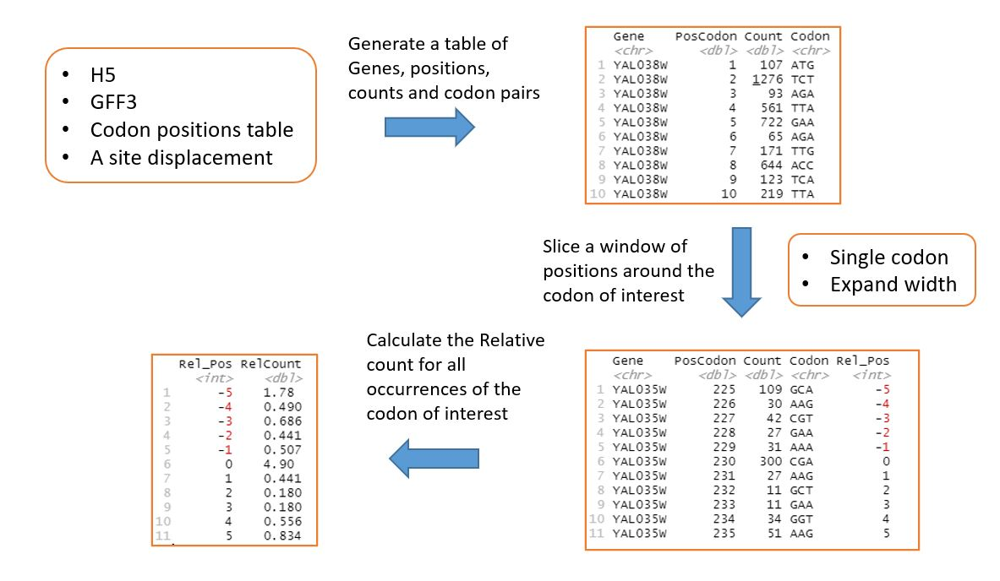
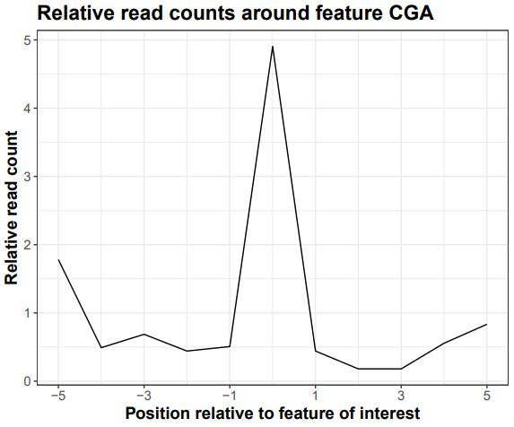
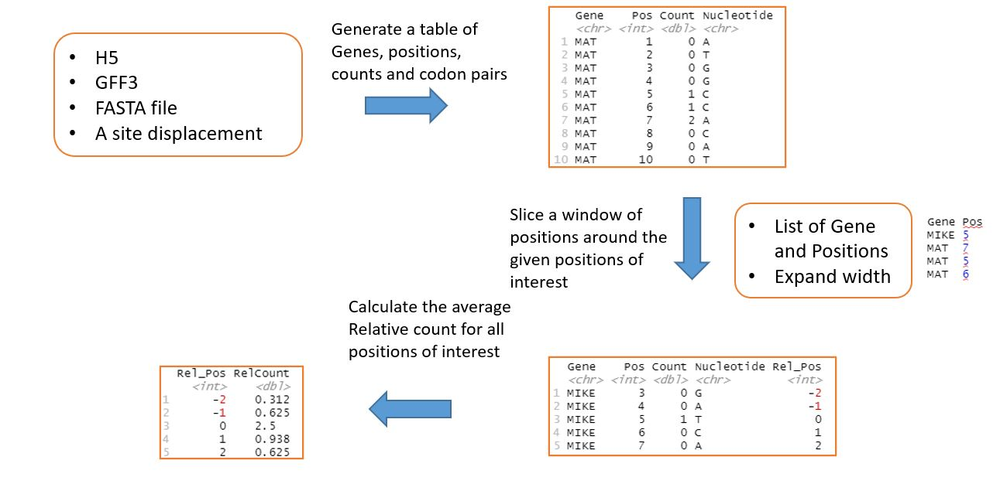
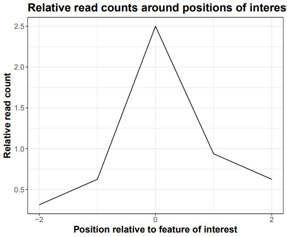
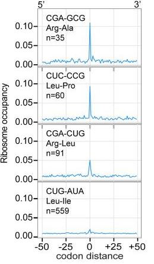
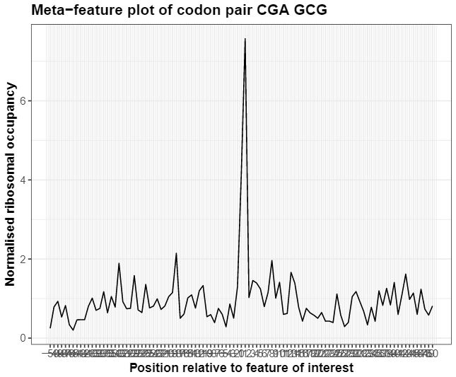
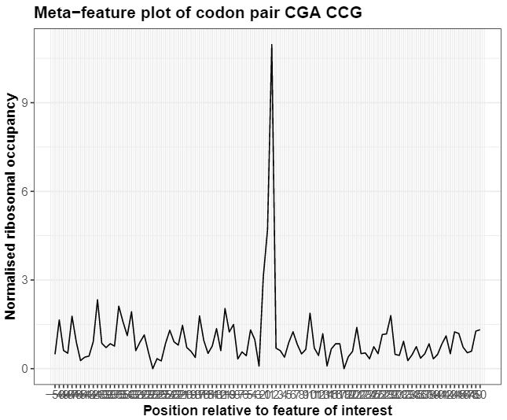
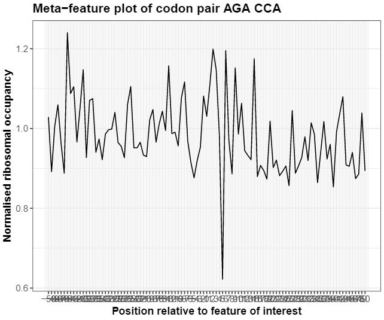

```{r setup, include=FALSE}
knitr::opts_chunk$set(echo = FALSE)
```

<script src="https://ajax.googleapis.com/ajax/libs/jquery/1.12.2/jquery.min.js"></script>

<script>
    $(document).ready(function() {
      $('slide:not(.title-slide, .backdrop, .segue)').append('<footer label=\"riboviz"></footer>');    
    })
</script>

<style>
  footer:after {
    content: attr(label);
    font-size: 12pt;
    position: absolute;
    bottom: 20px;
    left: 100px;
    line-height: 1.9;
  }
</style>

<style type="text/css">
slides > slide:not(.nobackground):after {
  content: '';
}
</style>


## TODO Us! (Maybe change picture? :D)

<div style="float: left; width: 30%;">
```{r, out.width = "300"}
knitr::include_graphics("https://raw.githubusercontent.com/FlicAnderson/EdinbR-20210519/main/images/Me.jpg")
```  


</div>

<div style="float: right; width: 55%;">
### TODO Change title of this bit

**Staff** at the [Wallace Lab](https://ewallace.github.io/), TODO from WHEN TO WHEN

* _some_
* **bullet** 
* points
</div>


## Outline: 

* Where we started
* Upgraded configs 
* Added documentation
* Added a new dataset
* Updated file names 
* Created meta features scripts 
* What we learnt

## Where we started:

We came in at the start of our honours project with no experience working with Git or Github, a limited understanding of R, and having rarely used command line. We quickly had to learn:

* How to confidently use command line 
* How to navigate different branches
* How to push and pull commits 
* How to set up and run the riboviz pipeline

## Overview of end of honours project

* Sophie was looking into inhibitory codon pairs, and had created scripts with the goal of creating metafeature plots when given a  codon pairs or a single.
* I was looking at how the use of upstream open reading frames changed under different conditions. I had created a script to plot reads on a transcript and compare the number of reads present in different regions. 


## Upgraded configs 

* Updated configuration yamls in example-datasets by running riboviz.tools.upgrade_config_file 
* Necessary as older scripts lacked many of the newer parameters

## Added documentation

* Added Add-new-dataset.md in riboviz/example-datasets 
    - Documentation of steps involved in adding new species and new datasets to the riboviz/example-datasets repository 

* Created a template with checklist for adding a new dataset
    - Checklist template you can select when creating an issue ticket for the addition of a new species and/or a new dataset

* Added riboviz-outputs.md, which describes the different output files and figures. 

## Added new dataset 

* Why _Histoplasma capsulatum_: fungal pathogen, commonly observed in immunocompromised patients 

* Followed documentation in Add-new-dataset.md to test its usability 
* Added the new species _H. capsulatum_ to example-datasets
   - Assembled and tested annotation and contamination files for the species 
* Added a new dataset for _H. capsulatum_ from Anita Sil’s lab

## Outputs of new dataset, things to look out for in future

* Potentially due to poor annotation, a noncoding sequence is slipping into the final results. Overall there is good periodicity, so potential to analyse in the future

TO DO: add figure

## Updated file names 

To meet reviewers feedback, some of the confusing names had to be addressed. Pretty tedious work, as numerous files but I got my way through it.

## Article writing 

* Open science as an undergraduate. 
* look over and evaluate our time with the lab, gain a publication
* Practice writing

## Created metafeature scripts

* The goal of Sophie’s undergrad project was to investigate inhibitory codon pairs. This would be done by creating metafeature plots to see how different codons impact the rate of translation around codons of interest

* There are currently 3 scripts, which are running but need some refactoring:
    - A script for codon pairs 
    - A script for single codons 
    - A script that works by nucleotide position

## Codon pairs workflow



## Codon pairs testing with YAL5 simulated dataset



## Single codons workflow



## Testing with YAL5 simulated dataset



## Nucleotides workflow



## Testing with the Tinysim simulated dataset 



## Recreating data from Gamble et al. 2016





## Comparing inhibitory and optimised codon pairs 





## Next steps

* Add functionality to identify feature locations for nt metafeature script
    - Is there a tool or protein database that can identify positions of secondary        structural features? Can this data be downloaded for each gene? Will the names       be compatible? Ligand binding positions?
* Restructure to have one script containing function definitions and another calling the functions.
* Run on multiple species and datasets. 

## What we learnt

* Collaboration - prioritization of tasks that aid the team
* Communication – better updates on Github and clearer comments in code
* Insights into the process of writing papers
* Insights into software development and maintenance 
* Greatly improved the quality of code we write


## Thanks to everyone in the lab!