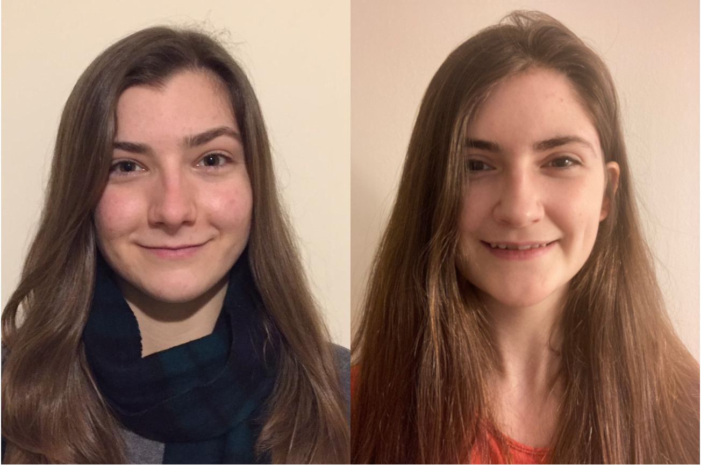
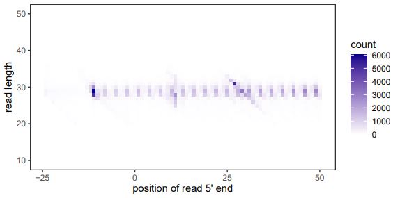
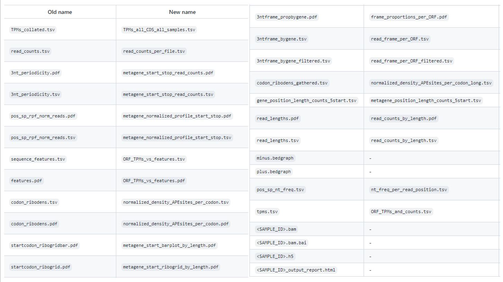
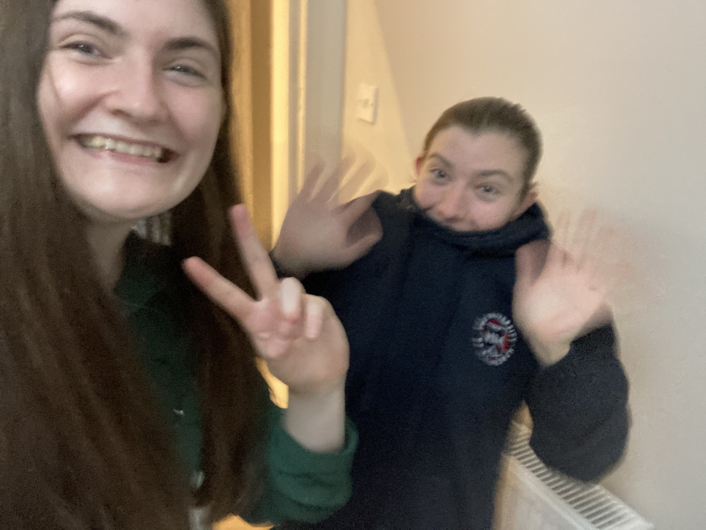

```{r setup, include=FALSE}
knitr::opts_chunk$set(echo = FALSE)
```

<script src="https://ajax.googleapis.com/ajax/libs/jquery/1.12.2/jquery.min.js"></script>

<script>
    $(document).ready(function() {
      $('slide:not(.title-slide, .backdrop, .segue)').append('<footer label=\"riboviz"></footer>');    
    })
</script>

<style>
  footer:after {
    content: attr(label);
    font-size: 12pt;
    position: absolute;
    bottom: 20px;
    left: 100px;
    line-height: 1.9;
  }
</style>

<style type="text/css">
slides > slide:not(.nobackground):after {
  content: '';
}
</style>


## Who are we

<div style="float: left; width: 30%;">
 


</div>

<div style="float: right; width: 40%;">

Currently Staff at the [Wallace Lab](https://ewallace.github.io/) working from the 21st of June until the start of our masters 


* Completed BSc (Hons) in Biological Sciences (Biotechnology)
* About to move on to an MSc in Bioinformatics 

**\+ Flic**, as _day-to-day supervisor_ & resident riboviz guide  
</div>


## Outline: 

* Where we started
* Upgraded configs 
* Added documentation
* Added a new dataset
* Updated file names 
* Created meta features scripts 
* What we learnt

## Where we started:

We came in at the start of our honours project with no experience working with Git or GitHub, a limited understanding of R, and having rarely used the command line. We quickly had to learn:

* How to confidently use the command line 
* How to navigate different branches
* How to push and pull commits 
* How to set up and run the riboviz pipeline

## Overview of end of honours project

* Sophie was looking into inhibitory codon pairs, and had created scripts with the goal of visualizing these features via metafeature plots when given a codon pair or a single codon.
* Emma was looking at how the use of upstream open reading frames changed under different conditions, and had created a script to plot reads on a transcript and compare the number of reads present in different regions. 


## Upgraded configs 

* Updated configuration yamls in example-datasets by running riboviz.tools.upgrade_config_file 
* Necessary as older scripts lacked many of the newer parameters in riboviz 2.0 which are needed for them to be run successfully 

## Added documentation

* Added Add-new-dataset.md in riboviz/example-datasets 
    - Documentation of steps involved in adding new species and new datasets to the riboviz/example-datasets repository 

* Created a template with checklist for adding a new dataset
    - Checklist template you can select when creating an issue ticket for the addition of a new species and/or a new dataset

* Added riboviz-outputs.md, which describes the different output files and figures. 

## Added new dataset 

* Why _Histoplasma capsulatum_: fungal pathogen, commonly observed in immunocompromised patients 

* Followed documentation in Add-new-dataset.md to test its usability 
* Added the new species _H. capsulatum_ to example-datasets
   - Assembled and tested annotation and contamination files for the species 
* Added a new dataset for _H. capsulatum_ from Anita Sil’s lab

## Outputs of new dataset, things to look out for in future

* Potentially due to poor annotation, a noncoding sequence is slipping into the final results. Overall there is good periodicity, so potential to analyse in the future




## Updated file names 

To meet reviewers feedback from the riboviz paper submission, some of the misleading names had to be addressed. After some discussion new names were selected which then had to be replaced.

A substantial task as there were numerous files and arguments that had to be renamed throughout riboviz. 

## File names changed 



## Article for The Biochemist  

* Topic: Open science in undergraduate projects. 

* Allowed us to reflect and evaluate our time with the lab
    - What good and bad
    - Lessons learned 
* Gained a publication and practiced our writing

## Created metafeature scripts

* The goal of Sophie’s undergraduate project was to investigate inhibitory codon pairs. This would be done by writing R scripts with the aim of creating metafeature plots to investigate how features impact the rate of translation.

* There are currently 3 scripts, which are running but need some refactoring:
    - A script for codon pairs 
    - A script for single codons 
    - A script that works by nucleotide position

## Codon pairs workflow


## Codon pairs testing with Mok-simYAL5 simulated dataset


## Single codons workflow


## Testing with Mok-simYAL5 simulated dataset


## Nucleotides workflow


## Testing with the Tinysim simulated dataset 


## Recreating data from Gamble et al. 2016


## Comparing inhibitory and optimised codon pairs 


## Next steps

* Write TESTTHAT scripts to test functionality of scripts and increase the integrity of the codon and codon pairs scripts
* Add functionality to identify feature locations for nt metafeature script
    - Is there a tool or protein database that can identify positions of secondary        structural features? Can this data be downloaded for each gene? Will the names       be compatible? Ligand binding positions?
* Restructure to have one script containing function definitions and another that calls these functions.
* Run on multiple datasets across species. 

## What we learnt

* Collaboration - prioritization of tasks that aid the team
* Communication – better updates on GitHub and clearer comments in code
* Insights into the process of writing papers
* Insights into software development and maintenance 
* Greatly improved the quality of code we write


## Thanks to everyone in the lab!

Hopefully see you all at the social and in the future!


